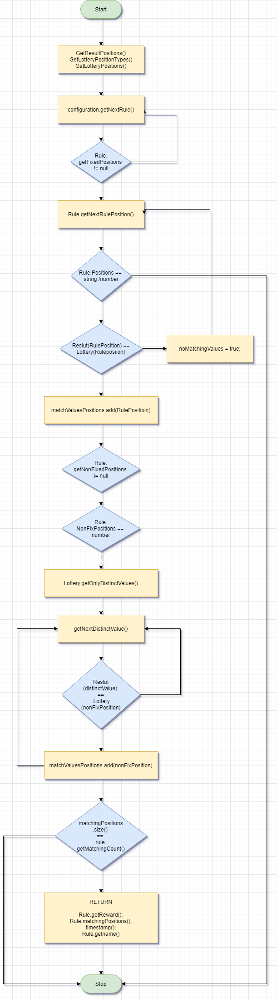

### Features

- Set configurations for Lottery matching patterns as YML files.
- Compatible with all major lottery types in Sri Lanka.
- Ability to setup draw numbers of particuler draw.
- Ability to send HTTP requests in both YML and JSON formats.

# Find My Luck

This Component is used to set Configuration of lottery winning patterns, and return relevent rewards, matching patterns and matching numbers of given Lottery as a format of JSON or YAML.

#### Algorithm Architecture

#### Configuration for single pattern

    - rule: Letter and any 3 numbers correct
    positions:
      - 1
    nonFixedPositions:
      - 2
      - 3
      - 4
      - 5
    level: 3
    positionalValue: false
    nonFixedType: number
    matchingCount: 4
    prize: 100000.00 
